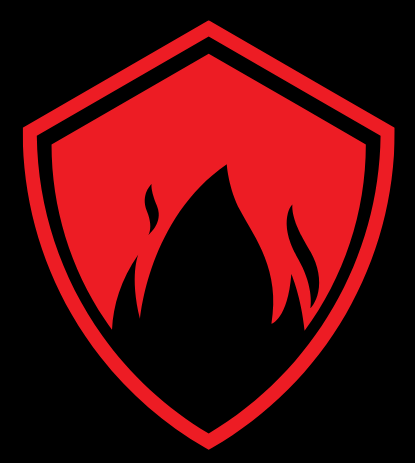
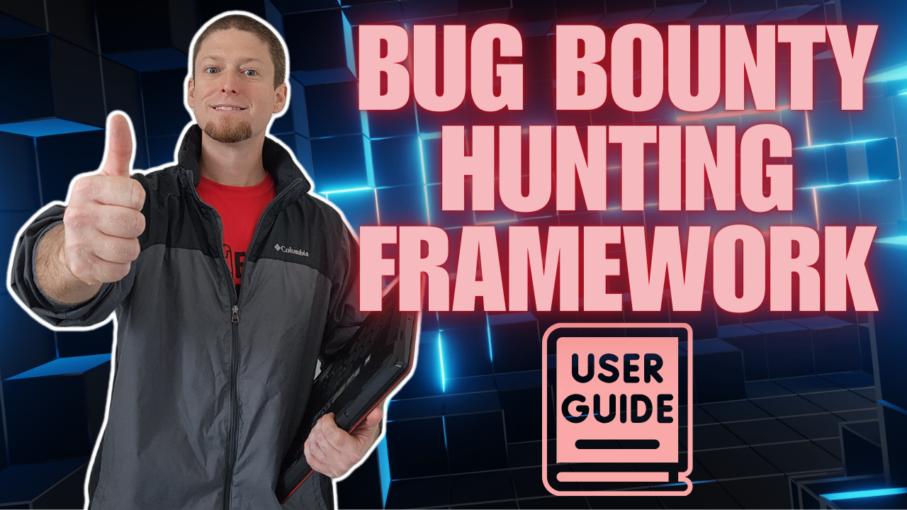

<h1 align="center">
  <a href="https://www.linkedin.com/in/%E2%84%8C%F0%9D%94%9E%F0%9D%94%AF%F0%9D%94%AF%F0%9D%94%A6%F0%9D%94%B0%F0%9D%94%AC%F0%9D%94%AB-%E2%84%9C%F0%9D%94%A6%F0%9D%94%A0%F0%9D%94%A5%F0%9D%94%9E%F0%9D%94%AF%F0%9D%94%A1%F0%9D%94%B0%F0%9D%94%AC%F0%9D%94%AB-%F0%9D%96%A2%F0%9D%96%A8%F0%9D%96%B2%F0%9D%96%B2%F0%9D%96%AF-%F0%9D%96%AE%F0%9D%96%B2%F0%9D%96%B6%F0%9D%96%A4-%F0%9D%96%AC%F0%9D%96%B2%F0%9D%96%BC-7a55bb158/"></a>
  <br>
  Dvine Hunter
  <br>
</h1>

<h3 align="center"><em>Plateforme française pour orchestrer vos campagnes de bug bounty et de sécurité offensive</em></h3>

<h4 align="center"><strong>Conçue pour accompagner les chercheurs en sécurité francophones</strong> — <em>par rs0n</em></h4>

<p align="center">
  <a href="#aperçu">Aperçu</a> •
  <a href="#demarrage-rapide">Démarrage rapide</a> •
  <a href="#telecharger-la-derniere-version-stable">Télécharger</a> •
  <a href="#installation">Installation</a> •
  <a href="#lancer-la-plateforme-client-et-serveur">Exécution</a> •
  <a href="#depannage">Dépannage</a> •
  <a href="#foire-aux-questions">FAQ</a> •
  <a href="https://ars0nsecurity.com" target="_blank">Ars0n Security</a> •
  <a href="https://www.youtube.com/@rs0n_live" target="_blank">YouTube</a> •
  <a href="https://www.twitch.tv/rs0n_live" target="_blank">Twitch</a>
</p>

<div align="center">
  <a href="https://www.youtube.com/watch?v=G89LTJRQC0M"></a>
</div>

## Aperçu

Dvine Hunter est une plateforme modulaire pensée pour simplifier la chasse aux failles applicatives. Elle centralise la reconnaissance, l’énumération, l’automatisation des scans et la génération de rapports au sein d’une interface moderne rouge et blanche. L’objectif est de permettre aux chercheurs francophones de planifier, exécuter et partager leurs analyses tout en conservant la pleine maîtrise de leurs données.

Chaque module peut être enrichi ou remplacé pour s’adapter à vos méthodologies internes. Grâce à une architecture inspirée des frameworks offensifs classiques, la plateforme encourage la collaboration entre les membres de votre équipe tout en vous laissant libre d’étendre les fonctionnalités existantes.

## Démarrage rapide

Collez ce bloc dans une installation propre de [Kali Linux 2023.4](https://www.kali.org/get-kali/#kali-installer-images) pour télécharger, installer et exécuter la dernière version stable :

```
sudo apt update && sudo apt-get update
sudo apt -y upgrade && sudo apt-get -y upgrade
wget https://github.com/R-s0n/ars0n-framework/releases/download/v0.0.2-alpha/ars0n-framework-v0.0.2-alpha.tar.gz
tar -xzvf ars0n-framework-v0.0.2-alpha.tar.gz
rm ars0n-framework-v0.0.2-alpha.tar.gz
cd ars0n-framework
./install.sh
```

## Télécharger la dernière version stable

```
wget https://github.com/R-s0n/ars0n-framework/releases/download/v0.0.2-alpha/ars0n-framework-v0.0.2-alpha.tar.gz
tar -xzvf ars0n-framework-v0.0.2-alpha.tar.gz
rm ars0n-framework-v0.0.2-alpha.tar.gz
```

## Installation

Dvine Hunter inclut un script qui installe tous les outils, paquets et dépendances nécessaires pour fonctionner sur une installation propre de [Kali Linux 2023.4](https://www.kali.org/get-kali/#kali-installer-images).

***La seule installation officiellement prise en charge est Kali Linux 2023.3 fraîchement installée.*** Si vous choisissez d’exécuter la plateforme ailleurs, aucun support ne pourra être fourni en cas de problème.

```
./install.sh
```

Cette [vidéo](https://www.youtube.com/watch?v=cF4xtVS7Rnc) illustre une installation réussie étape par étape.

**Si vous utilisez un processeur ARM, ajoutez l’option `--arm` à toutes les commandes d’installation et d’exécution.**

```
./install.sh --arm
```

Lorsque l’installation démarre, plusieurs clés API et jetons peuvent être renseignés. Ils ne sont pas indispensables pour exploiter les fonctionnalités principales. Appuyez simplement sur Entrée pour passer une valeur vide. Vous pourrez ajouter ces clés plus tard dans le répertoire `~/.keys`. Des informations complémentaires sont disponibles dans la [FAQ](#foire-aux-questions).

## Lancer la plateforme (Client et Serveur)

Une fois l’installation terminée, vous pouvez lancer l’application immédiatement en répondant `Y` lorsqu’elle vous le propose. Sinon, redémarrez-la à tout moment à partir du répertoire racine :

```
./run.sh
```

Si vous utilisez une architecture ARM :

```
./run.sh --arm
```

L’interface web permet d’ajouter des FQDN, de configurer vos modules de reconnaissance et de lancer les scans Wildfire. Tous les flux de travail hérités de la version d’origine restent disponibles, mais sont désormais présentés dans une interface modernisée en rouge et blanc.

### Configuration réseau du client web

Par défaut, l’interface web contacte l’API Express (port 8000) et le service Wildfire (port 5000) en fonction de l’origine sur laquelle elle est chargée :

* lorsqu’elle tourne en local (`localhost`), les ports historiques `8000` et `5000` sont utilisés ;
* si vous servez l’interface depuis un nom de domaine ou une IP publique, la même origine que celle du navigateur est ciblée automatiquement.

Dans les scénarios où les API sont exposées sur d’autres URL, vous pouvez forcer les points d’accès en créant un fichier `client/.env` avant de lancer `npm start` ou `npm run build` :

```
REACT_APP_API_BASE_URL=https://mon-domaine.tld/api
REACT_APP_TOOLKIT_BASE_URL=https://mon-domaine.tld/wildfire
```

Les valeurs sont lues au démarrage de l’application React et peuvent pointer vers n’importe quel reverse-proxy ou service externe.

## Dépannage

La majorité des soucis d’installation ou d’exécution proviennent d’un système Kali non vierge. Dvine Hunter orchestre de nombreux outils open source qui peuvent entrer en conflit avec d’autres services présents sur la machine.

Assurez-vous également que MongoDB est correctement installé et actif. Si l’ajout d’un FQDN initial échoue ou si l’interface reste vide, vérifiez les ressources système disponibles pour la base de données.

## Foire aux questions

Des ressources complémentaires, guides détaillés et réponses aux questions courantes seront publiés prochainement. En attendant, vous pouvez suivre les annonces sur les réseaux sociaux listés ci-dessus.
